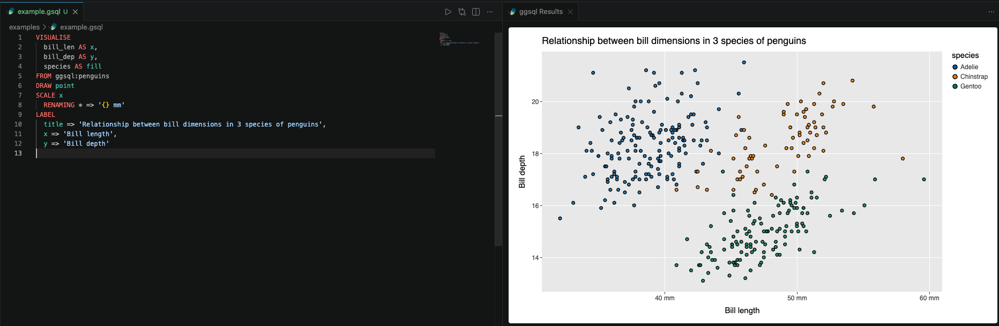

# ggsql for VSCode

[ggsql](https://ggsql.org) is a SQL extension for declarative data visualization based on Grammar of Graphics principles. It combines SQL data queries with visualization specifications in a single, composable syntax.

This project is a fork of the official [ggsql-vscode extension](https://github.com/posit-dev/ggsql/tree/main/ggsql-vscode) and focuses on extensive features for VS Code instead of [Positron IDE](https://positron.posit.co/).

## Features

- Complete syntax highlighting for ggsql queries.
- `.gsql`/`.ggsql` file extension support.
- Run queries directly from the editor (run button, code lenses, `Cmd/Ctrl+Enter` on cells) via the [ggsql CLI](https://ggsql.org).
- Rendered charts appear in a results panel next to your editor, powered by [Vega-Lite](https://vega.github.io/vega-lite/).



## Requirements

Running queries requires the `ggsql` CLI to be installed and available on your `PATH` (or configured via the `ggsql.executablePath` setting). Syntax highlighting works without it.

See the official [installation instructions](https://ggsql.org/get_started/installation.html) for further guidance. Restart VS Code after installation.

## Settings

| Setting | Default | Description |
| --- | --- | --- |
| `ggsql.reader` | `duckdb://memory` | Data source connection string passed to the CLI via `--reader` (e.g. `duckdb://path/to.db`, `sqlite://path/to.db`, `odbc://...`). |
| `ggsql.executablePath` | *(empty)* | Path to the `ggsql` executable. If empty, `ggsql` is resolved from `PATH`. |

## Example

```sql
VISUALISE
  bill_len AS x,
  bill_dep AS y,
  species AS fill
FROM ggsql:penguins
DRAW point
SCALE x 
  RENAMING * => '{} mm'
LABEL
  title => 'Relationship between bill dimensions in 3 species of penguins',
  x => 'Bill length',
  y => 'Bill depth'
```

## Installation

You can download the extension from the GitHub releases and install it manually:

1. Download `vscode-ggsql-0.1.0.vsix` from [Releases](https://github.com/probstal/vscode-ggsql/releases)
2. Install via the command line:

```bash
code --install-extension vscode-ggsql-0.1.0.vsix
```

Or install from within the editor: open the Extensions view, click the `...` menu, select "Install from VSIX...", and choose the downloaded file.

## Learn More

Visit [ggsql.org](https://ggsql.org) to get started with ggsql, explore the documentation, and see more examples.
